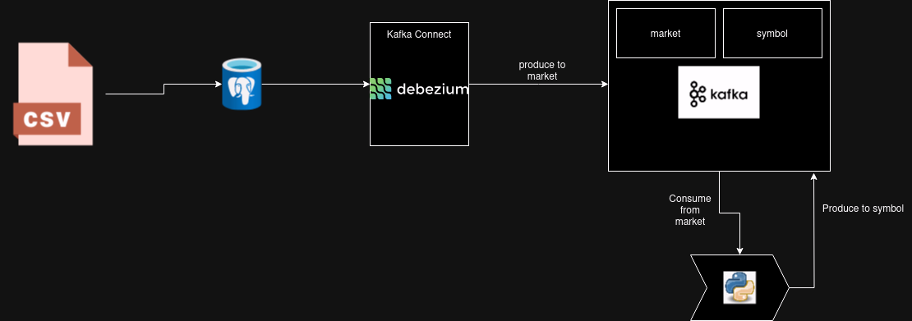

# EquityFlow
The purpose of this project is build an end to end real time applications with the aim to learn the following concepts:
- Kafka
  - Kafka connect (Change Data capture using Debezium)
  - Kafka streams (using java)
- Elastic search (quering)
- Kibaba (visualisation)

#### Data Flow
The data for this project is the minute level stock price with attributes such as timestamp, symbol, open close and high price. The source of the data is a postgres DB (or this can be any other source that either incremental update with records over time or a another real time data source)

Simulating data real time data:
- The postgres DB is inserted with new records every minute by incrementally reading a csv file (using python)
- The data can be directly produced to kafka, although in this project it done using kafka connect. 
- I have used debezuim for CDC that looks at the logs of postgres db to capture and produce row-level changes such as insert, update and delete events into kafka topics.
- The kafka stream calculates the moving average (10 minute window) of close price using ktable and windowing operation produce the result to kafka.
